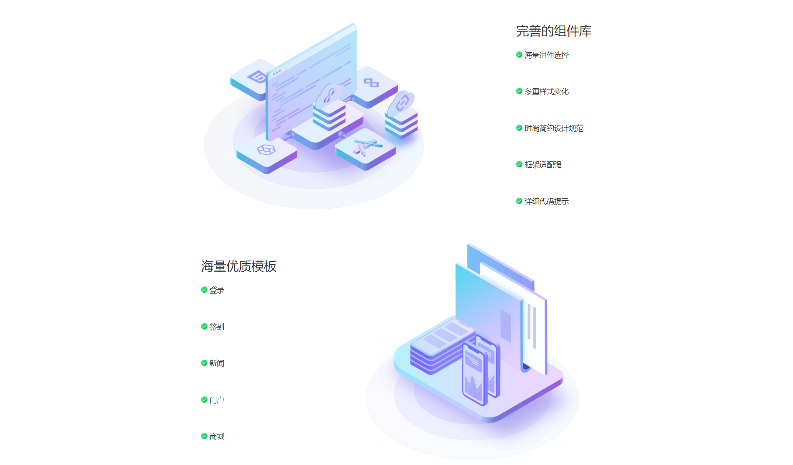
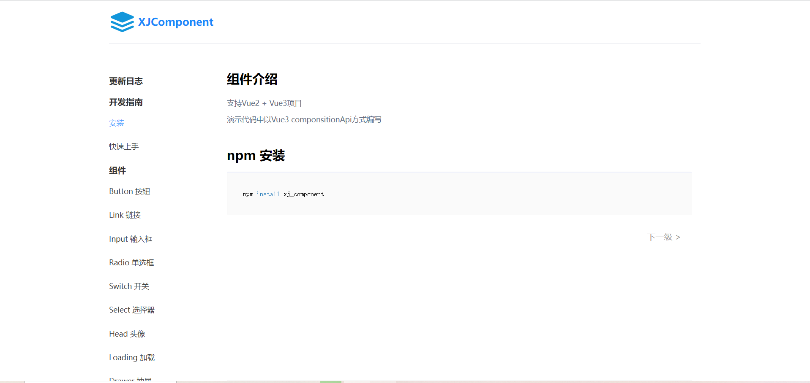
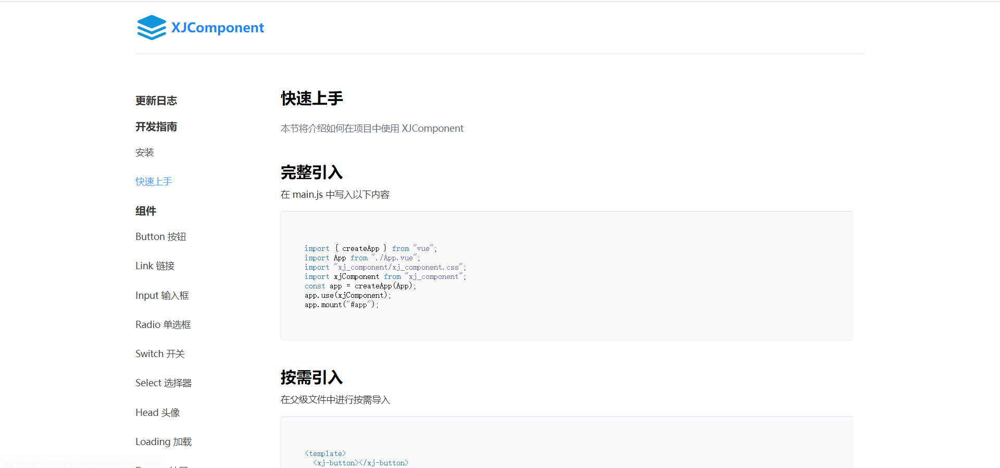
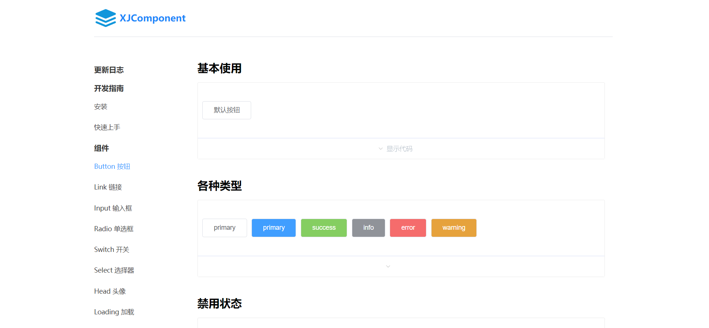
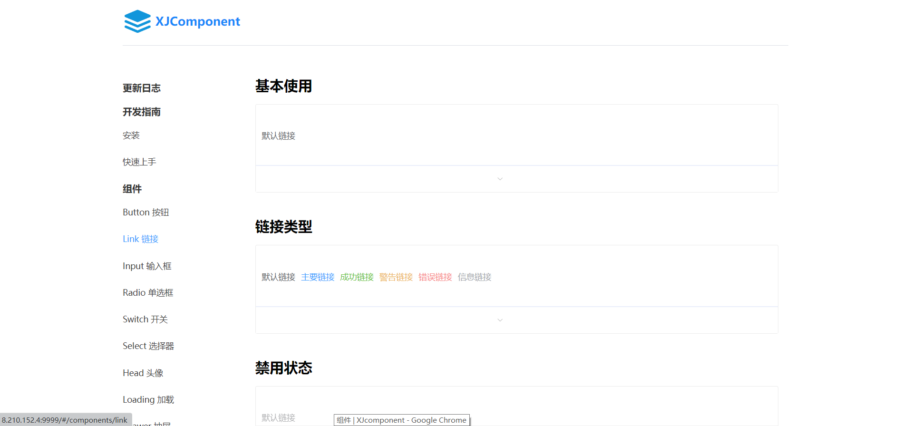
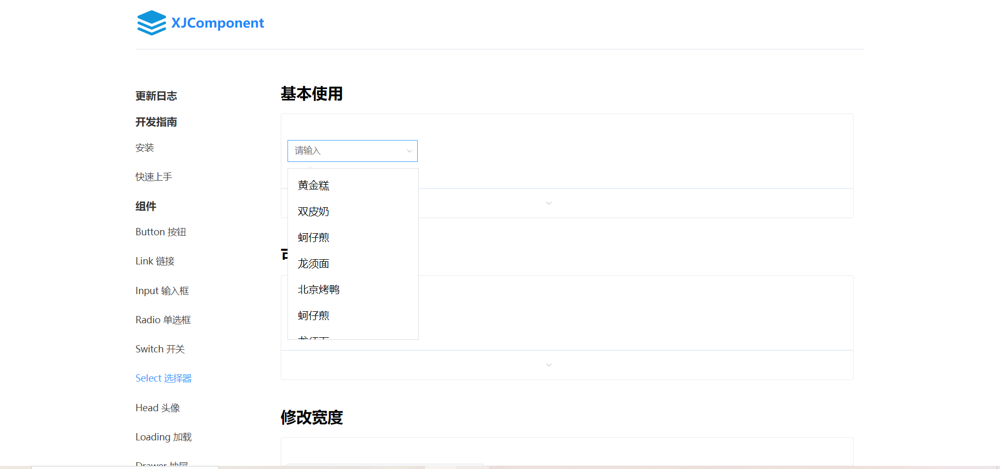
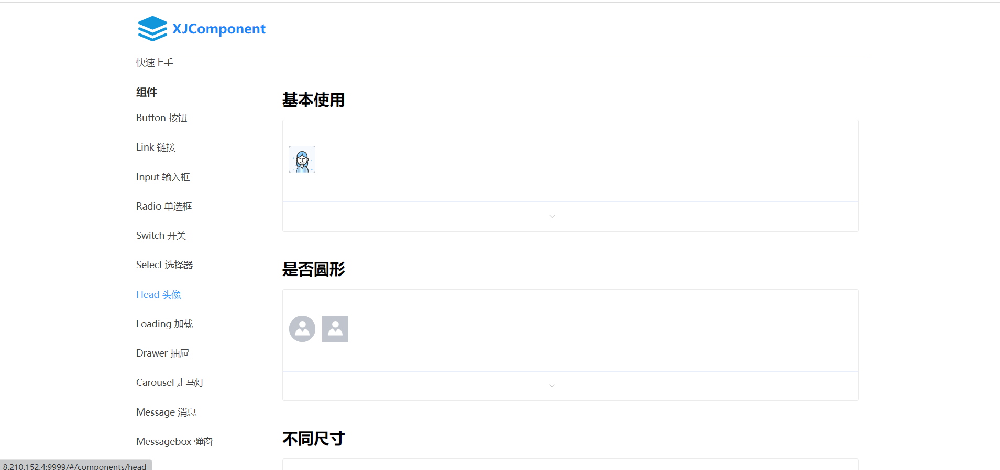

# XJComponent

#### 如果对您有帮助的话，请点个 starred，谢谢您

#### 组件库支持 vue2 与 vue3 项目，支持 ts 环境，已开发出 button 按钮，messgae 消息提示，carousel 走马灯，select 多选框，drawer 抽屉等组件

#### 代码包括显示的网站代码 src/ 和原生组件代码 packages/ 运行时必须要使用 cnpm install 安装依赖

#### 查看上线网站效果 http://8.210.152.4:9999/#/home

#### 使用组件库 npm install xj_component

## 部分效果展示










## 如何使用？

### 安装依赖包，必须为 cnpm install 因为部分依赖用 npm 无法获取

```
cnpm install
```

### 启动项目

```
npm run serve
```

### 打包项目

```
npm run build
```

### Customize configuration

See [Configuration Reference](https://cli.vuejs.org/config/).
